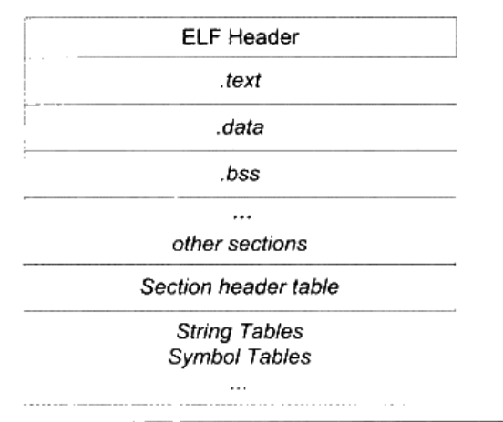

#第3章 目标文件里有什么
##3.1 目标文件的格式
现在PC平台流行的可执行文件格式主要是Windows下的PE（Portable Executable）和Linux的ELF（Executable Linkable Format），它们都是COFF（Common file format）格式的变种。目标文件就是源代码编译后但未进行链接的那些中间文件，它跟可执行文件的内容和结构很相似，所以一般跟可执行文件格式一起采用一种格式存储。

不光是可执行文件按照可执行文件格式存储。动态链接库和静态链接库文件都按照可执行文件格式存储。

<table>
<tr>
	<th>ELF文件类型</th>
	<th>说明</th>
	<th>实例</th>
</tr>
<tr>
	<td>可重定位文件（Relocatable File）</td>
	<td>这类文件包含了代码和数据，可以被用来链接成可执行文件或共享目标文件，静态链接库也可以归为这一类</td>
	<td>Linux的.o Windows的.obj</td>
</tr>
<tr>
	<td>可执行文件（Executable File）</td>
	<td>这类文件包含了可以直接执行的程序，它的代表就是ELF可执行文件，它们一般都没有扩展名</td>
	<td>比如/bin/bash文件 Windows的.exe</td>
</tr>
<tr>
	<td>共享目标文件（Shared Object File）</td>
	<td>这种文件包含了代码和数据，可以在以下两种情况下使用。一种是链接器可以使用这种文件跟其他的可重定位文件和共享目标文件链接，产生新的目标文件。第二种是动态链接器可以将几个这种共享目标文件与可执行文件结合，作为进程映像的一部分来运行</td>
	<td>Linux的.so，如/lib/glibc-2.5.so Windows的DLL</td>
</tr>
<tr>
	<td>核心转储文件（Core Dump File）</td>
	<td>当进程意外终止时，系统可以将该进程的地址空间的内容及终止时的一些其他信息转储到核心转储文件</td>
	<td>Linux下的core dump</td>
</tr>
</table>

##3.2 目标文件是什么样的
ELF文件的开头是一个“文件头”，它描述了整个文件的文件属性，包括文件是否可执行、是静态链接还是动态链接及入口地址（如果是可执行文件）、目标硬件、目标操作系统等信息，文件头还包括一个段表，段表其实是一个描述文件中各个段的数组。段表描述了文件中各个段在文件中的偏移位置及段的属性等，从段表里面可以得到每个段的所有信息。文件头后面就是各个段的内容，比如代码段保存的就是程序的指令，数据段保存的就是程序的静态变量等。

一般C语言的编译后执行语句都编译成机器代码，保存在.text段；已初始化的全局变量和局部静态变量都保存在.data段；未初始化的全局变量和局部静态变量一般放在一个叫“.bss”的段里。程序运行的时候它们的确是要占内存空间的，并且可执行文件必须记录所有未初始化的全局变量和局部静态变量的大小总和，记为.bss段。所以.bss段只是为未初始化的全局变量和局部静态变量预留位置而已，它并没有内容，所以它在文件中也不占据空间。

**总体来说，程序源代码被编译以后主要分成两种段：程序指令和程序数据。代码段属于程序指令，而数据段和.bss段属于程序数据。**

数据和指令分段的好处：

- 一方面是当程序被装载后，数据和指令分别被映射到两个虚存区域。由于数据区域对于进程来说是可读写的，而指令区域对于进程来说是只读的，所以这两个虚存区域的权限可以被分别设置成可读写和只读。这样可以防止程序的指令被有意或无意地改写。
- 另外一方面是对于现代的CPU来说，它们有着极为强大的缓存体系。由于缓存在现代的计算机中地位非常重要，所以程序必须尽量提高缓存的命中率。指令区和数据区的分离有利于提高程序的局部性。现代CPU的缓存一般都被设计成数据缓存和指令缓存分离，所以程序的指令和数据被分开存放对CPU的缓存命中率提高有好处。
- 第三个原因，就是当系统中运行着多个该程序的副本时，它们的指令都是一样的，所以内存中只需要保存一份改程序的指令部分。

##3.3 挖掘SimpleSection.o
可以使用binutils的工具objdump来查看object内部的结构。GCC和binutils被移植到各种平台上，所以它们支持多种目标文件格式。比如Windows下的GCC和binutils支持PE文件格式、Linux版本支持ELF格式。Linux还有一个很不错的工具叫readelf，它是专门针对ELF文件格式的解析器，很多时候它对ELF文件的分析可以跟objdump相互对照。

###3.3.1 代码段
`objdump -s -d xxx.o`

###3.3.2 数据段和只读数据段
.data段保存的是那些已经初始化了的全局静态变量和局部静态变量。.rodata段存放的是只读数据，一般是程序里面的只读变量（如const修饰的变量）和字符串常量。

###3.3.3 BSS段
.bss段存放的是未初始化的全局变量和局部静态变量。

###3.3.4 其他段
<table>
	<tr>
		<th>常用的段名</th>
		<th>说明</th>
	</tr>
	<tr>
		<td>.rodata1</td>
		<td>Read only Data，这种段里存放的时只读数据，比如字符串常量、全局const变量。跟.rodata一样</td>
	</tr>
	<tr>
		<td>.comment</td>
		<td>存放的时编译器版本信息，比如字符串：“GCC:(GNU)4.2.0”</td>
	</tr>
	<tr>
		<td>.debug</td>
		<td>调试信息</td>
	</tr>
	<tr>
		<td>.dynamic</td>
		<td>动态链接信息</td>
	</tr>
	<tr>
		<td>.hash</td>
		<td>符号哈希表</td>
	</tr>
	<tr>
		<td>.line</td>
		<td>调试时的行号表，即源代码行号与编译后指令的对应表</td>
	</tr>
	<tr>
		<td>.note</td>
		<td>额外的编译器信息。比如程序的公司名、发布版本号等</td>
	</tr>
	<tr>
		<td>.strtab</td>
		<td>String Table.字符串表，用于存储ELF文件中用到的各种字符串</td>
	</tr>
	<tr>
		<td>.symtab</td>
		<td>Symbol Table.符号表</td>
	</tr>
	<tr>
		<td>.shstrtab</td>
		<td>Section String Table.段名表</td>
	</tr>
	<tr>
		<td>.plt .got</td>
		<td>动态链接的跳转表和全局入口表</td>
	</tr>
	<tr>
		<td>.init .fini</td>
		<td>程序初始化与终结代码段</td>
	</tr>
</table>

####自定义段
我们在全局变量或函数之前加上`__attribute__((section("name")))`属性就可以把相应的变量或函数放到以"name"作为段名的段中。

##3.4 ELF文件结构描述

ELF目标文件格式的最前部是ELF文件头，它包含了描述整个文件的基本属性，比如ELF文件版本、目标机器型号、程序入口地址等。紧接着是ELF文件各个段。其中ELF文件中与段有关的重要结构就是段表（Section Header Table），该表描述了ELF文件包含的所有段的信息，比如每个段的段名、段的长度、在文件中的偏移、读写权限及段的其他属性。

###3.4.1 文件头
可以用readelf命令来详细查看ELF文件。ELF文件头中定义了ELF魔数、文件机器字节长度、数据存储方式、版本、运行平台、ABI版本、ELF重定位类型、硬件平台、硬件平台版本、入口地址、程序头入口和长度、段表的位置和长度及段的数量等。

###3.4.2 段表
段表是ELF文件中除了文件头以外最重要的结构，它描述了ELF的各个段的信息，比如每个段的段名、段的长度、在文件中的偏移、读写权限及段的其他属性。

###3.4.3 重定位表
链接器在处理目标文件时，需要对目标文件中某些部位进行重定位，即代码段和数据段中那些对绝对地址的引用的位置。这些重定位的信息都记录在ELF文件的重定位表里面，对于每个需要重定位的代码段或数据段，都会有一个相应的重定位表。

###3.4.4 字符串表
一般字符串表在ELF文件中也以段的形式保存，常见的段名为”.strtab”或“.shstrtab”。这两个字符串表分别为字符串表和段表字符串表。顾名思义，字符串表用来保存普通的字符串，比如符号的名字；段表字符串表用来保存段表中用到的字符串，最常见的就是段名。

##3.5 链接的接口——符号
