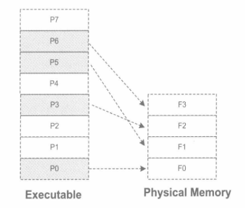

#第6章 可执行文件的装载与进程
##6.1 进程虚拟地址空间
硬件决定了地址空间的最大理论上限，即硬件的寻址空间大小。进程只能使用操作系统分配给进程的地址，如果访问未经允许的空间，那么操作系统就会捕获到这些访问，将进程的这种访问当作非法操作，强制结束进程。我们经常在Windows下碰到令人讨厌的“进程因非法操作需要关闭”或Linux下的“Segmentation fault”很多时候是因为进程访问了未经允许的地址。

###PAE
32位的CPU下，程序使用的空间能不能超过4GB呢？这个问题其实应该从两个角度来看，首先，问题里面的“空间”如果是指虚拟地址空间，那么答案是“否”。因为32位的CPU只能使用32位的指针，它最大的寻址范围是0到4GB；如果问题里面的“空间”指计算机的内存空间，那么答案为“是”。Intel自从1995年的Pentium Pro CPU开始采用了36位的物理地址，也就是可以访问高达64GB的物理内存。

从硬件层面上来讲，原先的32位地址线只能访问最多4GB的物理内存。但是自从扩展至36位地址线之后，Intel修改了页映射的方式，使得新的映射方式可以访问到更多的物理内存。Intel把这个地址扩展方式叫做PAE（Physical Address Extension）。

在应用程序里，只有32位的虚拟地址空间。那么应用程序该如何使用这些大于常规的内存空间呢？一个很常见的方法就是操作系统提供一个窗口映射的方法，把这些额外的内存映射到进程地址空间中来。在Windows下，这种访问内存的操作方式叫做AWE（Address Windowing Extensions）；而像Linux等UNIX类操作系统则采用mmap()系统调用来实现。

##6.2 装载的方式
程序执行时所需要的指令和数据必须在内存中才能够正常运行，最简单的办法就是将程序所需要的指令和数据全都装入内存中，这样程序就可以顺利运行，这就是最简单的静态装入的办法。但是很多情况下程序所需要的内存数量大于物理内存的数量，研究发现，程序运行时是有局部性原理的，所以我们可以将程序最常用的部分驻留在内存中，而将一些不太常用的数据存放在磁盘里面，这就是动态装载的基本原理。

覆盖装入（Overlay）和页映射（Paging）是两种很典型的动态装载办法，原则上都是利用了程序的局部性原理。

###6.2.1 覆盖装入
覆盖装入的办法把挖掘内存潜力的任务交给了程序员，程序员在编写程序的时候必须手工将程序分割成若干块，然后编写一个小的辅助代码来管理这些模块何时应该驻留内存而何时应该被替换掉。这个小的辅助代码就是所谓的覆盖管理器（Overlay Manager）。

事实上程序往往不止两个模块，在多个模块的情况下，程序员需要手工将模块按照它们之间的调用依赖关系组织成树状结构。

- 这个树状结构中从任何一个模块到树的根模块都叫调用路径。当该模块被调用时，整个调用路径上的模块都必须在内存中。
- 禁止跨树间调用。任意一个模块不允许跨过树状结构进行调用。

###6.2.2 页映射
页映射是虚拟存储机制的一部分，它随着虚拟存储的发明而诞生。与覆盖装入的原理相似，页映射也不是一下子就把程序的所有数据和指令都装入内存，而是将内存和所有磁盘中的数据和指令按照“页”为单位划分为若干个页，以后所有的装载和操作的单位就是页。

##6.3 从操作系统角度看可执行文件的装载
如果程序使用物理地址直接进行操作，那么每次页被装入时都需要进行重定位。在虚拟存储中，现代的硬件MMU都提供地址转换的功能。有了硬件的地址转换和页映射机制，操作系统动态加载可执行文件的方式跟静态加载有了很大的区别。

###6.3.1 进程的建立
事实上，从操作系统的角度来看，一个进程最关键的特征是它拥有独立的虚拟地址空间，这使得它有别于其他进程。创建一个进程，然后装载相应的可执行文件并且执行。在有虚拟存储的情况下，上述过程最开始只需要做三件事情：

- 创建一个独立的虚拟地址空间。
- 读取可执行文件头，并且建立虚拟地址空间与可执行文件的映射关系。
- 将CPU的指令寄存器设置成可执行文件的入口地址，启动运行。