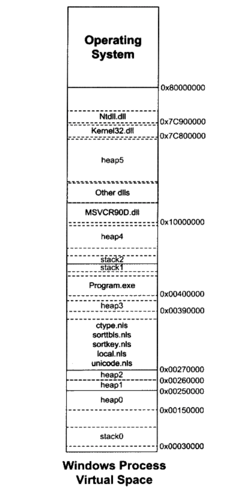

#第10章 内存
内存是装载程序运行的介质，也是程序进行各种运算和表达的场所。

##10.1 程序的内存布局
在32位系统里，内存空间拥有4GB的寻址能力。相对于16位时代i386的短地址加段内偏移的寻址模式，如今的应用程序可以直接使用32位的地址进行寻址，这被称为平坦的内存模型。

尽管当前的内存空间号称是平坦的，但实际上内存仍然在不同的地址区间上有着不同的地位，例如，大多数操作系统会将4GB的内存空间上的一部分挪给内核使用，应用程序无法直接访问这一段内存，这一部分内存地址被称为内核空间。Windows在默认情况下会将高地址的2GB空间分配给内核，而Linux默认情况下将高地址的1GB空间分配给内核。

用户使用的剩下2GB或3GB的内存空间称为用户空间。在用户空间里，有许多地址区间有特殊的地位：

- 栈： 栈用于维护函数调用的上下文，离开了栈函数调用就没法实现。栈通常在用户空间的最高地址处分配。
- 堆：堆是用来容纳应用程序动态分配的内存区域，当程序使用malloc或new分配内存时，得到的内存来自堆里。堆通常存在于栈的下方，在某些时候，堆也可能没有固定统一的存储区域。堆一般比栈大很多。
- 可执行文件映像：这里存储着可执行文件在内存里的映像，由装载器在装载时将可执行文件的内存读取或映射到这里。
- 保留区：保留区并不是一个单一的内存区域，而是对内存中受到保护而禁止访问的内存区域的总称。例如，大多数操作系统里，极小的地址通常都是不允许访问的，如NULL。


动态链接库映射区用于映射装载的动态链接库。在Linux下，如果可执行文件依赖其他共享库，那么系统就会为它在从0x40000000开始的地址分配相应的空间，并将共享库载入到该空间。

> 段错误是怎么回事？
>
> 这是典型的非法指针解引用造成的错误。当指针指向一个不允许读或写的内存地址，而程序却试图利用指针来读或写该地址的时候，就会出现这个错误。
> 在Linux或Windows的内存布局中，有些地址是始终不能读写的，例如0地址。还有些地址是一开始不允许读写，应用程序必须事先请求获取这些地址的读写权，或者某些地址一开始并没有映射到实际的物理内存，应用程序必须事先请求将这些地址映射到实际的物理地址，之后才能够自由地读写这片内存。当一个指针指向这些区域的时候，对它指向的内存进行读写就会引发错误。造成这样的最普遍的原因有两种：
>
> 1. 程序员将指针初始化为NULL，之后却没有给它一个合理的值就开始使用指针。
>
> 2. 程序员没有初始化栈上的指针，指针的值一般会是随机数，之后就直接开始使用指针。（野指针）

##10.2 栈与调用惯例
###10.2.1 什么是栈
在经典的计算机科学中，栈被定义为一个特殊的容器，用户可以将数据压入栈中，也可以将已经压入栈中的数据弹出，但栈这个容器必须遵守一条规则：先入栈的数据后出栈（FIFO）。

在计算机系统中，栈则是一个具有以上属性的动态内存区域。程序可以将数据压入栈中，也可以将数据从栈顶弹出。压栈操作使得栈增大，而弹出操作使栈减小。

在经典的操作系统里，栈总是向下增长的。在i386下，栈顶由称为esp的寄存器进行定位。压栈的操作使栈顶的地址减小，弹出的操作使栈顶地址增大。

栈在程序运行中具有举足轻重的地位。最重要的，栈保存了一个函数调用所需要的维护信息，这常常被称为堆栈帧（Stack Frame）或活动记录（Active Record）。堆栈帧一般包括如下几方面内容：

- 函数的返回地址和参数。
- 临时变量：包括函数的非静态局部变量以及编译器自动生成的其他临时变量。
- 保存的上下文：包括在函数调用前后需要保持不变的寄存器。

在i386中，一个函数的活动记录用ebp和esp这两个寄存器划定范围。esp寄存器始终指向栈的顶部，同时也就指向了当前函数的活动记录的顶部。而相对的，ebp寄存器指向了函数活动记录的一个固定位置，ebp寄存器又被称为帧指针（Frame Pointer）。一个很常见的活动记录实例如下所示：


在参数之后的数据（包括参数）即是当前函数的活动记录，ebp固定在图中所示的位置，不随这个函数的执行而变化，相反地，esp始终指向栈顶，因此随着函数的执行，esp会不断变化。固定不变的ebp可以用来定位函数活动记录的各个数据。在ebp之前首先是这个函数的返回地址，它的地址是ebp-4，再往前是压入栈中的参数，它们的地址分别是ebp-8、ebp-12等，视参数数量和大小而定。ebp所直接指向的数据是调用该函数前ebp的值，这样在函数返回的时候，ebp可以通过读取这个值恢复到调用前的值。之所以函数的活动记录会形成这样的结构，是因为函数调用本身是如此书写的：一个i386下的函数总是这样调用的：

- 把所有或一部分参数压入栈中，如果有其它参数没有入栈，那么使用某些特定的寄存器传递。
- 把当前指令的下一个指令的地址压入栈中。
- 跳转到函数体执行。

其中第2步和第3步由指令call一起执行。跳转到函数体之后即开始执行函数，而i386函数体的“标准”开头是这样的（但也可以不一样）：

- push ebp：把ebp压入栈中（称为old ebp）。
- mov ebp, esp：ebp = esp（这时ebp指向栈顶，而此时栈顶就是old ebp）。
- 【可选】sub esp, xxx：在栈上分配xxx字节的临时空间。
- 【可选】push xxx：如有必要，保存名为xxx寄存器（可重复多个）。

把ebp压入栈中，是为了在函数返回的时候便于恢复以前的ebp值。而之所以可能要保存一些寄存器，在于编译器可能要求某些寄存器在调用前后保持不变，那么函数就可以在调用开始时将这些寄存器的值压入栈中，在结束后再取出。函数返回则正好相反：

- 【可选】pop xxx：如有必要，恢复保存过的寄存器（可重复多个）。
- mov esp, ebp：恢复esp同时回收局部变量空间。
- pop ebp：从栈中恢复保存的ebp的值。
- ret：从栈中取得返回地址，并跳转到该位置。

###10.2.2 调用惯例
函数的调用方和被调用方对于函数如何调用须要有一个明确的规定，只要双方遵守同样的规定，函数才能被正确地调用，这样的规定被称为调用惯例。一个调用惯例一般会规定如下几个方面的内容：

- **函数参数的传递顺序和方式** 函数参数的传递有很多种方式，最常见的一种是通过栈传递。函数的调用方将参数压入栈中，函数自己再从栈中将参数取出。对于有多个参数的函数，调用惯例要规定函数调用方将参数压栈的顺序：是从左到右，还是从右到左。有些调用惯例还允许使用寄存器传递参数，以提高性能。
- **栈的维护方式** 在函数将参数压栈之后，函数体会被调用，伺候需要被压入栈中的参数全部弹出，以使得栈在函数调用前后保持一致。这个弹出的工作可以由函数的调用方来完成，也可以由函数本身来完成。
- **名字修饰的策略** 为了链接的时候对调用惯例进行区分，调用惯例要对函数本身的名字进行修饰。不同的调用惯例有不同的修饰策略。

<table>
	<tr>
		<th>调用惯例</th>
		<th>出栈方</th>
		<th>参数传递</th>
		<th>名字修饰</th>
	</tr>
	<tr>
		<td>cdecl</td>
		<td>函数调用方</td>
		<td>从右至左的顺序压参数入栈</td>
		<td>下划线+函数名</td>
	</tr>
	<tr>
		<td>stdcall</td>
		<td>函数本身</td>
		<td>从右至左的顺序压参数入栈</td>
		<td>下划线+函数名+@+参数的字节数</td>
	</tr>
	<tr>
		<td>fastcall</td>
		<td>函数本身</td>
		<td>头两个DWORD类型或者占更少字节的参数被放入寄存器，其他剩下的参数按从右至左的顺序压入栈中</td>
		<td>@+函数名+@+参数的字节数</td>
	</tr>
	<tr>
		<td>pascal</td>
		<td>函数本身</td>
		<td>从左至右的顺序压参数入栈</td>
		<td>较为复杂，参见pascal文档</td>
	</tr>
</table>

###10.2.3 函数返回值传递
函数将返回值存储在eax中，返回后函数的调用方再读取eax。但是eax本身只有4个字节，对于返回5~8字节对象的情况，几乎所有的调用惯例都是采用eax和edx联合返回的方式进行的。其中eax存储返回值要低4字节，而edx存储返回值要高1~4字节。而对于超过8字节的返回类型，一般会栈上额外开辟一片空间，并将这片空间的一部分作为传递返回值的临时对象，并将对象的地址作为隐藏参数传递给函数。

##10.3 堆与内存管理
###10.3.1 什么是堆
堆是一块巨大的内存空间，常常占据整个虚拟空间的绝大部分。在这片空间里，程序可以请求一块连续内存，并自由地使用，这块内存在程序主动放弃之前都会一直保持有效。

###10.3.2 Linux进程堆管理
Linux提供了两种堆空间分配方式：brk()系统调用和mmap()系统调用。

```C
int brk(void *end_data_segment);

void *mmap(void *start, size_t length, int prot, int flags, int fd, off_t offset);
```

glibc的malloc函数是这样处理用户的空间请求的：对于小于128KB的请求来说，它会在现有的堆空间里，按照堆分配算法为它分配一块空间并返回；对于大于128KB的请求来说，它会使用mmap()函数为它分配一块匿名空间，然后在这个匿名空间中为用户分配空间。

###10.3.3 Windows进程堆管理


Windows进程将地址空间分配给了各种EXE、DLL文件、堆、栈。其中EXE文件一般位于0x00400000起始地址；而一部分DLL位于0x10000000起始地址，如运行库DLL；还有一部分DLL位于接近0x80000000位置，如系统DLL、NTDLL.DLL、Kernel32.DLL。

Windows提供了一个API叫做VirtualAlloc()，用于向系统申请空间，它与Linux下的mmap非常相似。实际上VirtualAlloc()申请的空间不一定只用于堆，它仅仅是向系统预留了一块虚拟地址，应用程序可以按照需要随意使用。在使用VirtualAlloc()函数申请空间时，系统要求空间大小必须为页的整数倍，即对于x86系统来说，必须是4096字节的整数倍。为了避免造成大量的浪费，需要实现一个分配的算法。Windows堆管理器提供了与堆相关的API用来创建、分配、释放和销毁堆空间（HeapCreate、HeapAlloc、HeapFree和HeapDestroy）。

###10.3.4 堆分配算法
####1. 空闲链表
把堆中各个空闲的块按照链表的方式连接起来，当用户请求一块空间时，可以遍历整个链表，知道找到合适大小的块并且将它拆分；当用户释放空间时将它合并到空闲链表中。

####2. 位图
将整个堆划分为大量的块，每个块的大小相同。当用户请求内存的时候，总是分配整数个块的空间给用户，第一个块我们称为已分配区域的头，其余的称为已分配区域的主体。而我们可以使用一个整数数组来记录块的使用情况，由于每个块只有头/主体/空闲三种状态，因此仅仅需要两位即可表示一个块。


####3. 对象池
如果每一次分配的大小都一样，那么就可以按照这个每次请求分配的大小作为一个单位，把整个堆空间划分为大量的小块，每次请求时只需要找到一个小块就可以了。